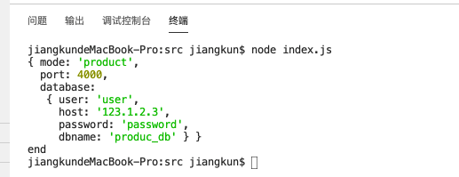
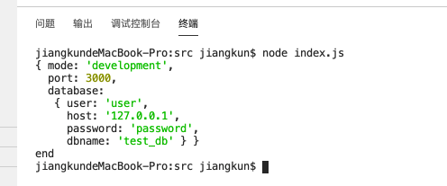
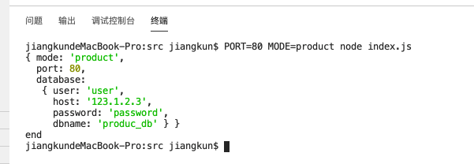

# 实战系列: 项目环境变量

主要出发点为运行环境变量的配置. 

由三个维度构成:

1. 命令行环境变量, 具有最高优先级
2. 配置文件环境变量
3. 全局配置文件环境变量

简要说明文件结构:

```
- global.conf.json           # 全局配置文件
- config/                    # 配置文件文件夹
  |- development.conf.json   # 开发配置文件
  `- product.conf.json       # 生产配置文件
```

> 所有配置可以使用 js 模块导出, 也可以使用 JSON 格式 ( 推荐 ). 代码为了可以添加注释使用的 js 模块导出.


所有的配置可以从命令行与配置文件中获得. 以监听端口为例:

可以基于命令行输入端口, 使用 `PORT` 环境变量.

```sh
PORT=3000 node index.js
```


可以使用全局配置设置端口: 

```json
{
  "mode": "development",
  "port": 3000
}
```

也可以使用配置文件来配置端口:

```json
{
  "port": 3000
}
```


**示例说明:**

`src/global.conf.js` 文件内容为:

```js
module.exports = {
  mode: 'product', 
  port: 5000
};
```

`src/config/development.conf.js` 文件内容为:

```js
module.exports = {
  port: 3000,
  database: {
    user: 'user',
    host: '127.0.0.1',
    password: 'password',
    dbname: 'test_db'
  }
};
```

`src/config/product.conf.js` 文件内容为:

```js
module.exports = {  
  port: 4000,
  database: {
    user: 'user',
    host: '123.1.2.3',
    password: 'password',
    dbname: 'produc_db'
  }
};
```

主文件 `src/index.js` 中的代码为:

```js
const config = require( './config' );

console.log( config );

console.log( 'end' );
```


执行 `node index.js` 可以得到:




如果修改 `src/global.conf.js` 文件中的逻辑:

```js
module.exports = {
  mode: 'development', 
  port: 5000
};
```

再次运行 `node index.js` 可以得到:




如果执行 `PORT=80 MODE=product node index.js` 则可以得到:




命令行环境变量可支持的配置参数可以在 `src/config/env-args-keys.js` 文件中定义. 该文件现在的代码为:

```js
const cmdArgKeys = [
  'MODE',
  'PORT'
].map( v => v.toUpperCase() );

module.exports = cmdArgKeys;
```

> 凡是在该列表中的参数名, 均可以从环境变量混入到配置中. 
>
> 环境变量中的变量名默认均大写.


